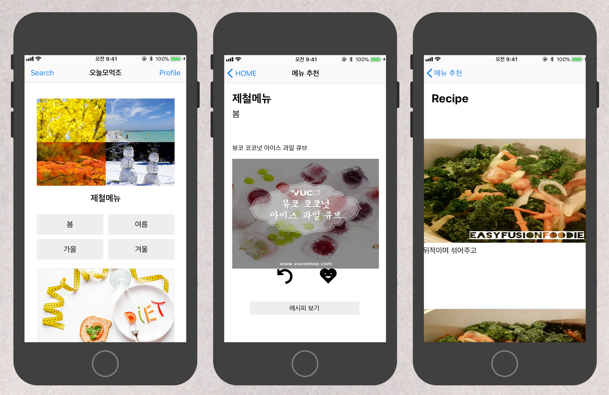
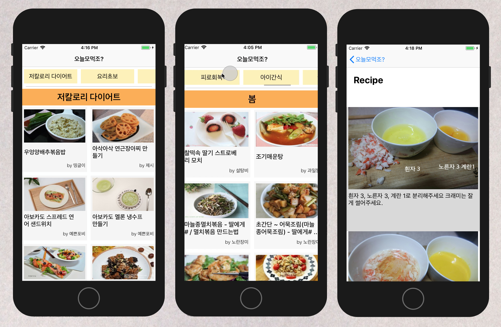

# 오늘모먹조? (What Are We Eat Today?) - 해커톤 프로젝트

> - 패스트캠퍼스 iOS 스쿨 수강생들과 1박 2일간 해커톤을 진행하며 [만개의레시피](http://www.10000recipe.com/theme/list.html)의 음식과 레시피를 보여주는 앱을 제작하였습니다.
> 
> - 기획 의도  
 > -. 3개월간의 수업 내용을 모두 반영할 수 있는 어플을 개발해 보자.  
 > -. 정해진 시간안에 기획안 안에서 구상한 부분을 모두 실현해 보자.  

 

## Contents
- [About App](#about-app)
- [About Team](#about-team)
- [Review](#review)

 

## About App

**[ver.1]**

 
>-. 기간 : 2018.03.23-24   
>    
-. 해커톤으로 1박 2일동안 진행.    
-. 만개의레시피 웹사이트의 음식 중 한가지를 랜덤으로 추천하고 레시피를 보여줌   
-. 새로고침 버튼을 통해 선택한 카테고리의 음식을 재추천 받을 수 있음   

 

**[ver.2]**

> -. 기간 : 2018.03.28   
>  
-. ver.1에 대한 아쉬움을 보완하여 재진행   
-. 랜덤으로 음식을 추천해 주는 것이 아닌 전체 음식을 모두 보여주는 앱으로 변경   
-. UI 변경, AutoLayout 및 애니메이션 구현  

  

**[사용 라이브러리]**

- Alamofire

 

## About Team
- 박성은 : Front
- 이주형 : Backend

 

## Review

### [ver.1]

#### ㅇ 어려웠던 부분
- Team 
    - 주석 처리 : 도움을 요청할 때, 내가 쓴 코드에 대한 설명이 부족해서 여러번 말로 설명해주어야 했고, 나조차도 뭐에 관한 코드였는지 헷갈리는 경우도 있었음. 다음 협업시에는 주석을 잘 달아서 팀원 간의 소통 + 코드 이해도를 높일 것.

- Develop
    - TableView 뷰 내에 CollectionView를 중첩시키는 UI를 처음 시도해봐서 매우 어려웠음. 
    - Delegate : 중첩된 콜렉션 뷰 안의 셀을 선택했을 때, 다음 컨트롤러 뷰로 넘어가게 해야 하는데 현재 뷰컨트롤러에 대한 정보는 cell 안에 없었기 때문에 한참 고민. Custom Delegate를 만들면서 해결하였고, delegate에 대한 이해도가 높아짐.

 

#### ㅇ 새로 알게된 점 + 다른 팀도 이런 점을 알았으면 좋겠다는 부분
- Custom Delegate 활용
- Backend와의 협업
- TableView 내 CollectionView 중첩

 
  
#### ㅇ 아쉬웠던 부분과 보완할 부분
 - 아쉬운 점
    - UI 기획은 했으나, 이를 어떻게 구현할 것인지에 대한 "개발 기획"이 없었음. 데이터 모델링, 디자인 패턴, 서버에서 어디까지 데이터를 가공해서 전달받을 것인지 등.
    - 서버 / 프론트로 분업이 확실하게 되다보니 git을 다뤄볼 기회가 많지 않았음.
    - AutoLayout을 적용하였으나, 일부 기기에서는 제대로 작동하지 않음.

 

- 다시 프로젝트 진행시 보완할 점

    1. 데이터 모델 구성 및 디자인 패턴 적용  
        -. 데이터 - 싱글턴 / MVC 패턴

    2. 랜덤 메뉴 추천이 아닌 카테고리에 해당되는 모든 음식 list를 가져와서 보여주기  
        -. 홈페이지 메뉴 추천의 1페이지부터 끝 페이지까지 모두 크롤링

    3. 모든 데이터를 서버와 연동해서 가져오기  
        -. 카테고리에 해당되는 텍스트까지 서버와 연동 (지금은 raw data형태로 삽입)  
        -. 지금은 이전 뷰에서 서버와 연동. 받은 데이터를 다음 뷰로 전달하는 형태였는데, 모두 뷰의 데이터를 서버와 연동할 것

    4. 검색기능 추가
    5. 애니메이션 효과

 
-----

 

### ver.2
- 대부분의 아쉬운 점들을 모두 보완하여 진행했고, AutoLayout 또한 제대로 작동함.

 

#### ㅇ 새로 시도한 부분   
- ScrollView에 ViewController를 추가하여 뷰를 보여주는 UI를 적용
- 스크롤 뷰를 스크롤링 할 때, 상단의 콜렉션 뷰도 카테고리가 하나씩 움직이능 애니메이션을 적용

#### ㅇ 아쉬운 점  
- 데이터를 로딩하는데 너무 오랜 시간이 걸림. 로딩 중이라는 것을 유저에게 보여줄 수 있는 장치가 필요. (Keyword: Activity Indicators)
- 검색 기능을 구현하지 못함
